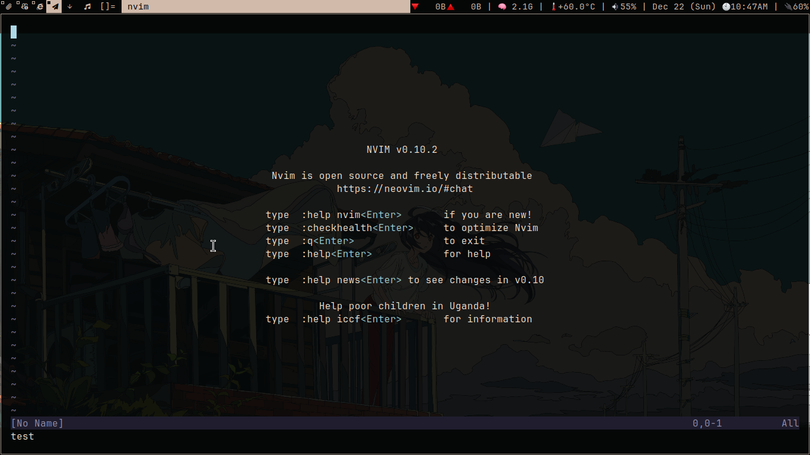
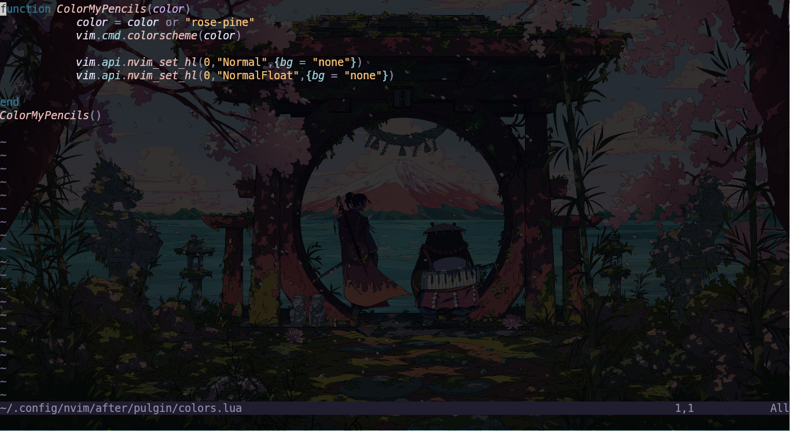
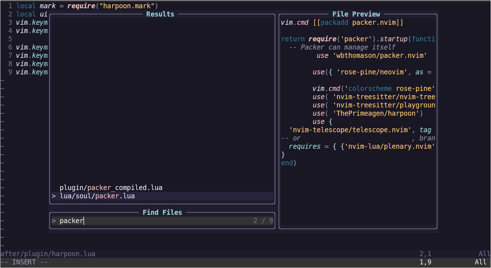
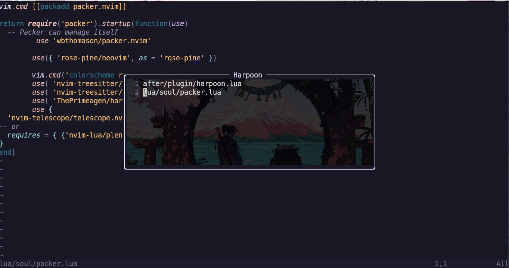
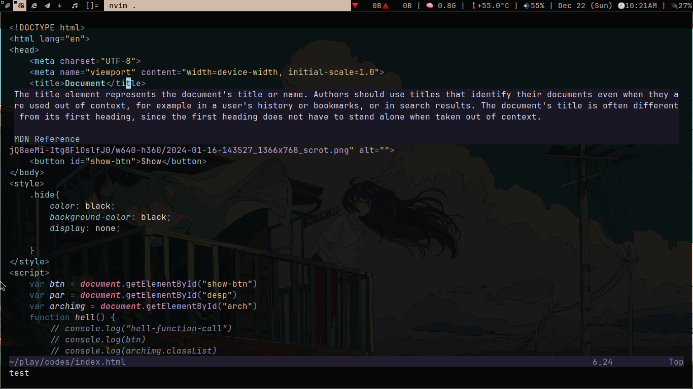
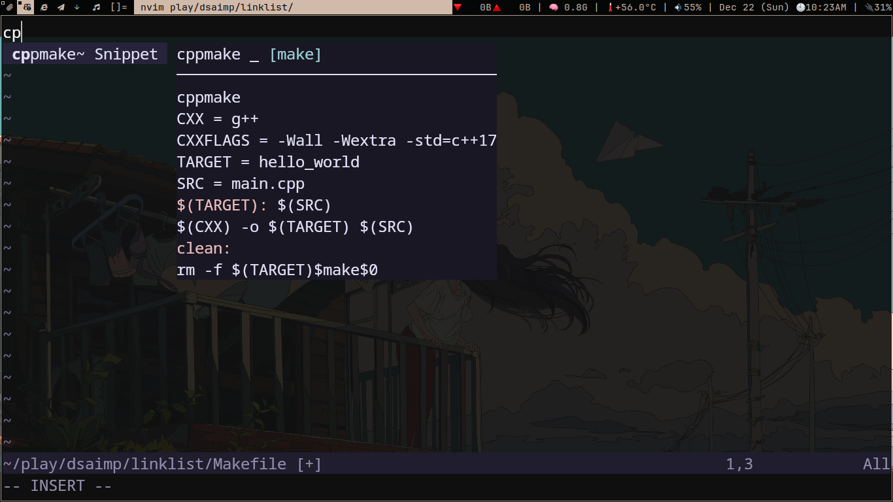
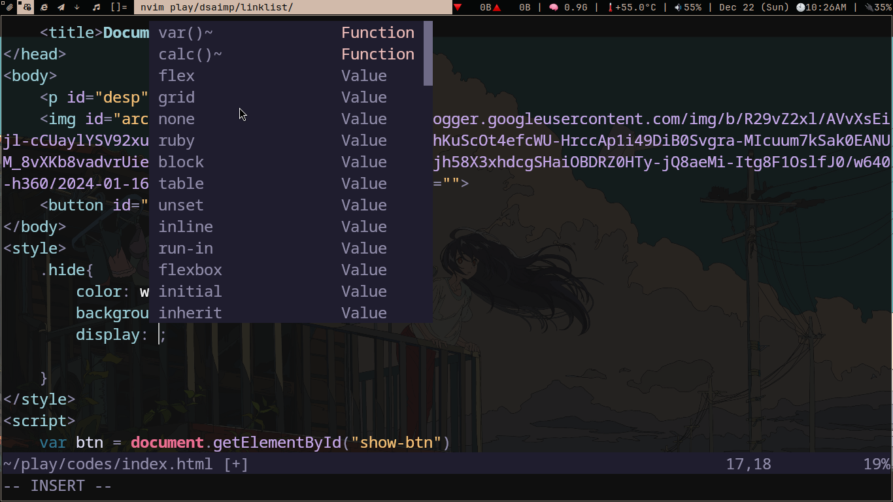

<div align="center">
  <h1>Neovim configuration</h1>
  <blockquote align="center">
    A minimal Neovim configuration written in lua
  <br />
</div>

This repository contains my custom Neovim configuration optimized for productivity, modern features, and plugin management. It includes support for LSP, autocompletion, syntax highlighting, and more.

---

## Table of Contents

1. [Features](#features)
2. [Installation](#installation)
3. [Configuration Structure](#configuration-structure)
4. [Plugins](#plugins)
5. [Screenshots](#screenshots)
6. [Customizations](#customizations)
7. [License](#license)

---

## Features

- **LSP Support**: Integrated with Neovim's built-in LSP for coding assistance.
- **Autocompletion**: Powered by `nvim-cmp`.
- **Syntax Highlighting**: Configured with `nvim-treesitter`.
- **File Navigation**: Easy file search and navigation using `telescope.nvim`.
- **Undo History Management**: Enhanced undo experience with `undotree`.
- **Snippets**: Custom snippets for efficient coding.
- **Clipboard Integration**: Clipboard utilities for seamless copy-paste.
- **Theme and Aesthetics**: Custom color schemes for better visual appeal.

---

## Installation

### Prerequisites

- Neovim (>= 0.8)
- Git
- A package manager (e.g., `git`, `curl`, or `wget` and 'Packer' for plugin installation)

### Steps

1. Clone this repository into your Neovim configuration directory:
   ```bash
   git clone https://github.com/mukund58/neovim-config.git ~/.config/nvim
   ```
2. Install Package Manager (Packer)
    ```bash
    git clone --depth 1 https://github.com/wbthomason/packer.nvim\
    ```
    ```bash 
    ~/.local/share/nvim/site/pack/packer/start/packer.nvim
    ```
3. Install plugins:
   ```bash
   nvim +PackerSync
   ```
4. Restart Neovim, and you're ready to go!


---

## Plugins

This configuration leverages powerful plugins to extend Neovim's capabilities:

1. **[packer.nvim](https://github.com/wbthomason/packer.nvim)**: Plugin management.
2. **[nvim-treesitter](https://github.com/nvim-treesitter/nvim-treesitter)**: Syntax highlighting and code parsing.
3. **[nvim-cmp](https://github.com/hrsh7th/nvim-cmp)**: Autocompletion engine.
4. **[telescope.nvim](https://github.com/nvim-telescope/telescope.nvim)**: Fuzzy finder for files, text, and more.
5. **[undotree](https://github.com/mbbill/undotree)**: Undo history visualization.
6. **[harpoon](https://github.com/ThePrimeagen/harpoon)**: Project navigation.
7. **[masion.nvim](https://github.com/williamboman/mason.nvim)**: Language server Installer.

## Screenshots

#### Trasparent Background



#### Telescope
File search and navigation using Telescope:



#### Harrpon
File Navigation in seconds with fzf 



Switch Between two files using `Ctrl + a` and `Ctrl + s` and to mark `<spacebar> as`



#### LSP 
Autocompletion ,Language Server ,Snippets,Defination :








---


---

## Configuration Structure

The file structure is organized for modularity and readability:

```plaintext
.
├── after
│   └── plugin
│       ├── colors.lua       # Theme configuration
│       ├── harpoon.lua      # Harpoon plugin setup
│       ├── lsp.lua          # LSP-related configurations
│       ├── nvim-cmp.lua     # Completion plugin setup
│       ├── telescope.lua    # File search/navigation setup
│       ├── treesitter.lua   # Syntax highlighting configurations
│       └── undotree.lua     # Undo history management
├── init.lua                 # Main Neovim entry point
├── LICENSE                  # License for the configuration
├── lua
│   ├── snippets
│   │   ├── make.lua         # Snippets for Makefiles
│   │   └── python.lua       # Python snippets
│   └── soul
│       ├── clipboard.lua    # Clipboard utilities
│       ├── cmp.lua          # Custom completion tweaks
│       ├── init.lua         # Lua-based Neovim initialization
│       ├── lsp-config.lua   # Additional LSP configurations
│       ├── packer.lua       # Plugin management with Packer
│       └── remap.lua        # Custom key remappings
├── plugin
│   └── packer_compiled.lua  # Automatically generated plugin file
└── README.md                # Documentation
```
---

## Customizations

- **Key Remappings**:
  - Custom remappings for better productivity are in `lua/soul/remap.lua`.
- **Themes**:
  - Configured in `after/plugin/colors.lua` to enhance readability.
- **Snippets**:
  - Custom snippets are defined in the `lua/snippets/` directory for Python and Makefiles.

---

## License

This configuration is licensed under the GPL-3.0 License. See [LICENSE](LICENSE) for details.
