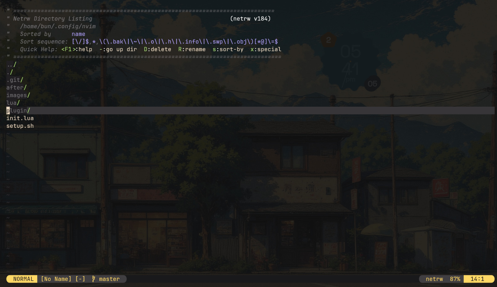

# Neovim Config



Personal Neovim configuration using Lua, packer.nvim, LSP, Telescope, Harpoon, and Conform.

## Setup

### Automated (recommended)

```bash
./setup.sh
```

Options:

- `--copy`: copy the config into `~/.config/nvim` instead of symlinking.
- `--no-sync`: skip `PackerSync` in headless mode.

### Manual

1. Install dependencies: `neovim`, `git`, `curl`, `ripgrep`, `fd`, `gcc/g++`, `make`, `python3`, `pip`, `nodejs`, `npm`.
2. Install packer.nvim:

```bash
git clone --depth 1 https://github.com/wbthomason/packer.nvim \
  ~/.local/share/nvim/site/pack/packer/start/packer.nvim
```

3. Place this repo at `~/.config/nvim` (or symlink it).
4. Run `:PackerSync` inside Neovim.

## Keybindings

Leader key is `Space`.

### General

| Mode | Key | Action |
| --- | --- | --- |
| normal | `Space e` | File explorer (`:Ex`) |
| normal | `Ctrl-h` | Window left |
| normal | `Ctrl-j` | Window down |
| normal | `Ctrl-k` | Window up |
| normal | `Ctrl-l` | Window right |
| normal | `Space u` | Toggle Undotree |
| normal | `Space qs` | Restore session (persistence.nvim) |
| normal | `Space ct` | Run clang-tidy on current file |
| normal/visual | `Space fm` | Format via Conform |

### LSP

| Mode | Key | Action |
| --- | --- | --- |
| normal | `gd` | Go to definition |
| normal | `K` | Hover documentation |
| normal | `gr` | Find references |
| normal | `Space rn` | Rename symbol |
| normal | `Space ca` | Code action |

### Telescope

| Mode | Key | Action |
| --- | --- | --- |
| normal | `Space pf` | Find files |
| normal | `C-p` | Git files |
| normal | `Space ps` | Grep (prompted) |

### Harpoon

| Mode | Key | Action |
| --- | --- | --- |
| normal | `Space a` | Add file |
| normal | `Space as` | Toggle quick menu |
| normal | `Ctrl-a` | Jump to file 1 |
| normal | `Ctrl-s` | Jump to file 2 |
| normal | `Ctrl-u` | Jump to file 3 |
| normal | `Ctrl-i` | Jump to file 4 |

### Completion (nvim-cmp + LuaSnip)

| Mode | Key | Action |
| --- | --- | --- |
| insert/select | `Tab` | Expand or jump snippet |
| insert/select | `Shift-Tab` | Jump backward in snippet |
| insert | `Ctrl-b` | Scroll docs up |
| insert | `Ctrl-f` | Scroll docs down |
| insert | `Ctrl-Space` | Trigger completion |
| insert | `Ctrl-e` | Abort completion |
| insert | `Enter` | Confirm selection |
